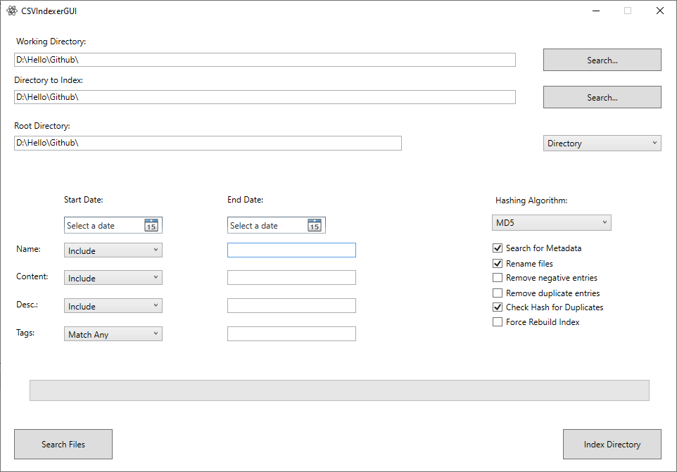
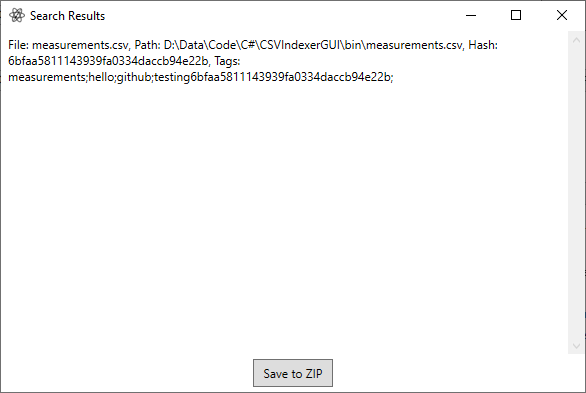

# CSVIndexerGUI

CSVIndexerGUI is a powerful tool designed to help index .csv files containing energy meter readings and similar information. Its main goal is to automate metadata indexing and provide an extensive search function with parameters for Timestamp, Name, Content, and Tags.

## Table of Contents
- [Use Case](#use-case)
- [Installation](#installation)
- [Features](#features)
  - [Indexing](#indexing)
  - [Searching](#searching)
- [File Formats](#file-formats)
  - [Metadata Format](#metadata-format)
  - [CSV File Format](#csv-file-format)
- [Screenshots](#screenshots)
- [Inner Workings](#inner-workings)
- [Technical Details](#technical-details)
- [License](#license)
- [Bugs and Limitations](#bugs-and-limitations)

## Use Case

CSVIndexerGUI is ideal for organizations and individuals who need to manage and search large collections of CSV files containing time-series data, such as energy meter readings. It simplifies the process of organizing, indexing, and retrieving data from multiple CSV files.

## Installation

To use this tool:
1. Download the latest Windows (standalone) release from the [Releases](https://github.com/SignorCC/CSVIndexerGUI/releases) page.
2. Alternatively, build it for the .NET Framework using Visual Studio 2022.

**Note for Linux users:** Due to WPF constraints, WINE is necessary for using the tool on Linux.

## Features

### Indexing

The tool offers two indexing modes:

1. **Directory Indexing:**
   - Recursively searches for .csv files in a specified directory.
   - Looks for `metadata.json` and `filename.json` to extract metadata.
   - Optionally renames files based on folder names.
   - Removes the string provided in "Root Directory" from file names for shorter names.
   - Creates file hashes (MD5 or SHA256) to prevent duplicates.
   - Copies indexed files to a specified working directory.
   - Creates an `allocationtable.json` in the working directory containing indexed files, their hash, and metadata.

2. **Single File Indexing:**
   - Bypasses metadata search and uses GUI-provided metadata.
   - Follows the same copying and hashing behavior as directory indexing.

**Additional Indexing Options:**
- "Ignore Duplicate Hashes": Adds files with duplicate hashes under the same hash key in the table.
- "Force Rebuild Index": Drops the entire list of a hash in question if a file with the same hash is indexed.
- If no `metadata.json` or `filename.json` is found in directory mode, the tool extracts available metadata from the file info.

### Searching

- Provides a user-friendly search interface with multiple parameters:
  - Start date
  - End date
  - Name (refers to the actual file name)
  - Content (refers to a unit of measurement, e.g., "kWh")
  - Tags (any additional metadata, including file hash and entire provided metadata except timestamp and numbers)
- Uses LINQ queries on the `allocationtable.json` for efficient searching.
- Displays results in a new window with the option to export found files as a .zip archive.
- Tags can be separated by ";", whitespaces are ignored.

## File Formats

### Metadata Format

```json
{
  "location": "Waste facility",
  "type": "electricity",
  "measurement": "Example Measurement",
  "description": "electrical energy meter",
  "unit": "kWh",
  "start timestamp": "2021-01-01T00:00:00.000000",
  "end timestamp": "2022-01-01T00:00:00.000000"
}
```

This metadata format is supported and expected by the tool. Anything else can lead to unexpected behavior. If timestamps are provided, the tool will attempt to parse them; if not, the file creation and last modification dates are used. The "unit" field is referred to as "content" in the search function. Additional fields containing at least 2 letters are added to the tags field (this prevents useless tags such as rows and columns from being added). Note that only values are added to the tags field; keys are ignored.

### CSV File Format

```csv
timestamp,meter reading,missing
2021-01-01 00:01:00+00:00,100,0
```

This format is expected by the tool when "Remove Duplicates" or "Remove Negatives" is checked. Processing .csv files is memory-intensive and results in longer indexing times. Hashes are calculated BEFORE editing the contents, meaning that for duplicate files to be caught, the files must be identical in their original state. The tool will not check for duplicates after processing the files.

## Screenshots



*Main interface of CSVIndexerGUI showing indexing options*



*Search results window with export functionality*

## Inner Workings

- Built using WPF and C# on .NET Framework 8.
- Uses Newtonsoft.Json library for JSON serialization.
- Employs LINQ queries for searching the `allocationtable.json`.
- Utilizes .NET's built-in functions for hashing and file compression.
- CSV file processing functionality can be extended by editing the CSVHelper class.
- Most of the logic resides in:
  - `Button_Search_Click` for searching (simple LINQ queries)
  - `ProcessDirectoryAsync()` and `ProcessSingleFileAsync()` for indexing
- Uses a Dispatcher to update GUI fields and progress bar during indexing due to the async nature of GUI applications.

## Technical Details

- Compatible with Windows 7 to 11.
- Future versions of the .NET Framework should be compatible as the functionality used is mostly IO, JSON serialization, LINQ, and light hashing.
- Built using Visual Studio 2022 and can be opened and edited using this IDE.

## License

This tool is licensed under the GNU General Public License v2.0. 

- Free to use and modify
- Any changes must be published under the same license
- No warranty provided
- Author not responsible for any damage caused by the tool

For commercial use, please contact the author for a commercial license.

## Bugs and Limitations

- The tool has not been extensively tested and may contain bugs.
- Indexing performance has not been optimized for maximum I/O throughput.
- Does not utilize multithreading for indexing operations.
- Actual indexing wasn't optimized, meaning that I/O throughput isn't maximized.

